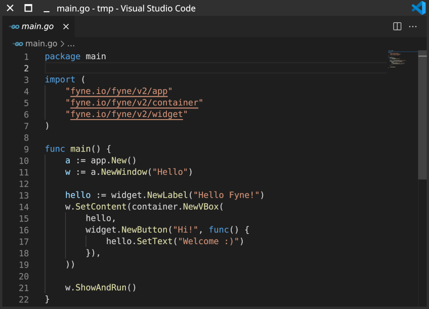

## Fyne

Fyne is a rapidly expanding cross-platform toolkit for the Go language. Apps run on desktop and mobile operating systems, with no runtime dependencies beyond an up to date graphics driver.

Fyne also underpins the FyneDesk project for a Material Design desktop experience.

## Further resources

* [Developer Documentation](https://docs.fyne.io)
* [FyneDesk Linux Desktop](https://fyshos.com/desktop)

